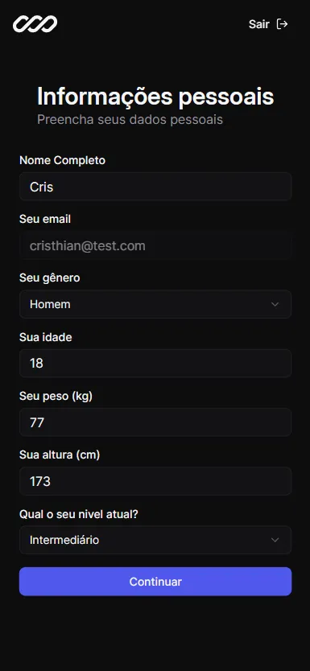
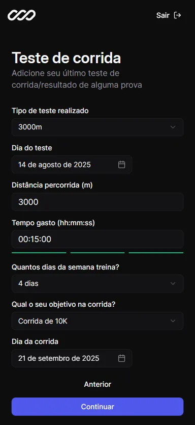
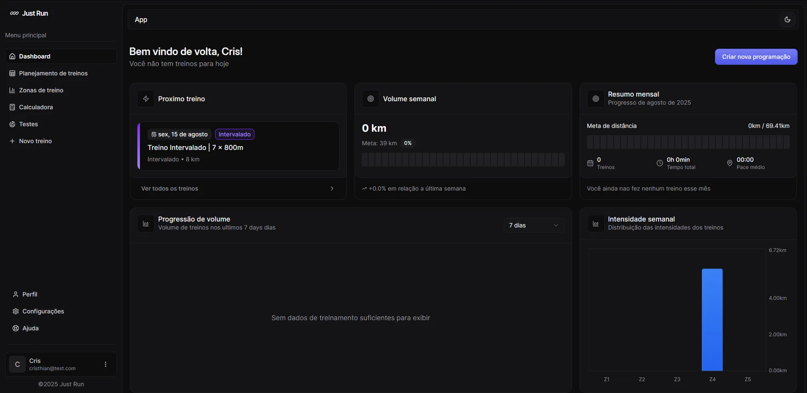
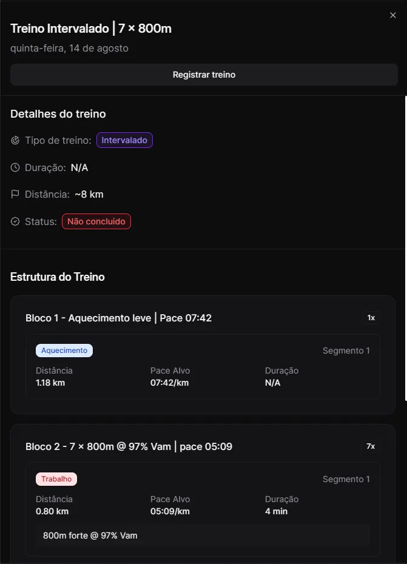
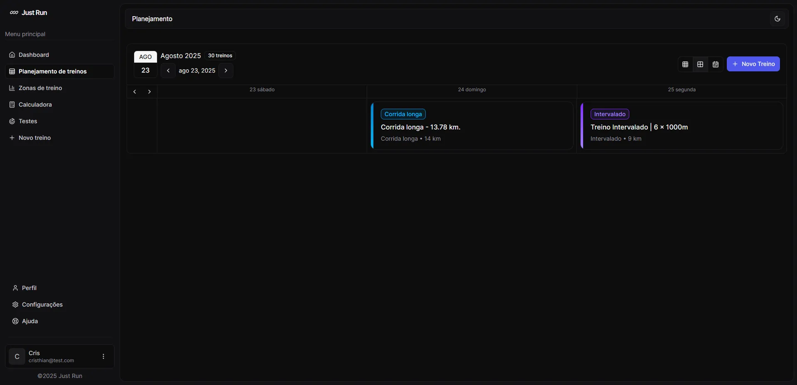
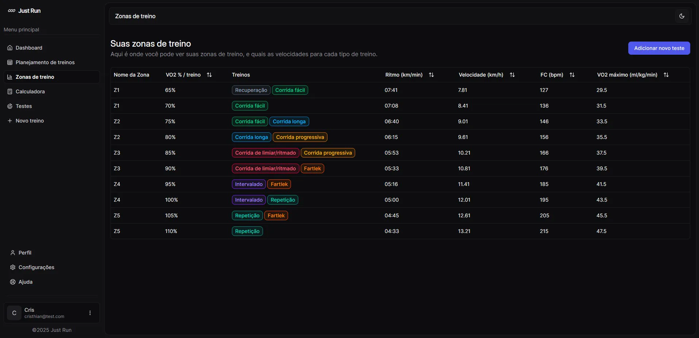
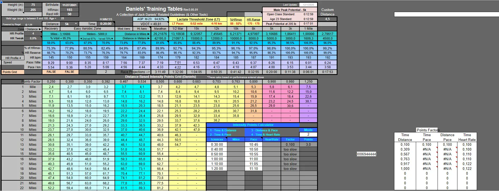
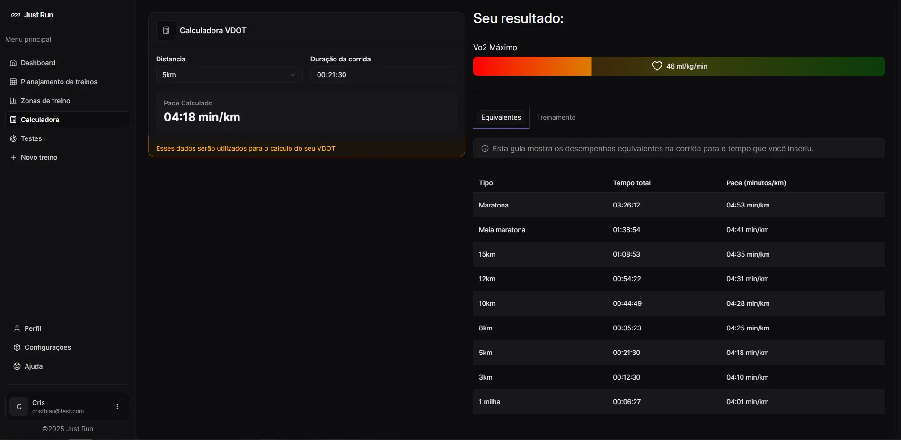

import Callout from "@/components/Callout.astro"

## Why I’m starting this log now
I’ve already built a good part of the app before deciding to write a development log.  
To avoid starting in the middle of the story, I’ll use this first entry to give some context, share my current progress, and outline my next steps.

---

## Project Overview
**JustRun** is an online platform for runners who want to improve their training results.  
Users can enter their personal details (age, gender, weight, height) and results from a running test.  
The app automatically calculates performance stats and generates a fully customized training periodization.

---

## Current Progress

### Onboarding
The onboarding flow consists of several steps where the user updates personal information such as weight, height, and age.  
This data will be used in training calculations.

<div class="grid grid-cols-1 sm:grid-cols-2 md:grid-cols-3 gap-4">
  <div class="">
    
  </div>
  <div class="">
    
  </div>
  <div class="">
    
  </div>
</div>

---

### Home Page
The home page displays key training metrics:
- Next scheduled workout  
- Weekly running volume  
- Monthly summary  
- Volume progression over time  
- Weekly intensity distribution



Clicking on a workout card opens the `<WorkoutSheet />`, showing:
- Full training structure  
- Estimated distance and time  
- Target paces and notes

<div class="flex justify-center">
  <div class="max-w-xs">
    
  </div>
</div>

### API Example

Here’s an example of a workout returned from the API:
```js title="/api/workouts/:id response" collapse={6-61}
{
  "runType": "INTERVAL",
  "scheduledStart": "2025-07-12T00:57:41.506Z",
  "title": "Treino Intervalado | 19 x 300m",
  "blocks": [
    {
      "blockKind": "WARMUP",
      "repeatCount": 1,
      "orderIndex": 1,
      "description": "Aquecimento leve | Pace 05:23",
      "segments": [
        {
          "plannedDistanceM": 1182,
          "orderInBlock": 1,
          "segmentKind": "WARMUP",
          "targetPaceSPerKm": 323
        }
      ]
    },
    {
      "blockKind": "WORK",
      "repeatCount": 19,
      "orderIndex": 2,
      "description": "19 x 300m @ 102% Vam | pace 03:24",
      "segments": [
        {
          "plannedDistanceM": 300,
          "orderInBlock": 1,
          "segmentKind": "WORK",
          "targetPaceSPerKm": 204,
          "plannedDurationS": 63,
          "notes": [
            "300m forte @ 102% Vam"
          ]
        },
        {
          "plannedDistanceM": 300,
          "orderInBlock": 2,
          "segmentKind": "FLOAT",
          "targetPaceSPerKm": 350,
          "plannedDurationS": 75,
          "notes": [
            "Descanso trotando"
          ]
        }
      ]
    },
    {
      "blockKind": "COOLDOWN",
      "repeatCount": 1,
      "orderIndex": 3,
      "description": "Desaquecimento leve | Pace 05:23",
      "segments": [
        {
          "plannedDistanceM": 788,
          "orderInBlock": 1,
          "segmentKind": "COOLDOWN",
          "targetPaceSPerKm": 323
        }
      ]
    }
  ],
  "plannedDistanceM": 7880,
  "notes": "Intervalo de 7.88km com ~9.75km de intensidade. VAM 17.14km/h. Nível intermediate."
},
```

---

### Workout planning page

The workout planning page shows the entire user current periodization in three different ways:
- Days
- Month  
- Week (this is a custom view that I kinda liked to develop)



To build this calendar, I've used the [Reat big calendar](https://www.npmjs.com/package/react-big-calendar) library, which is kinda easy to setup, just a few steps and it handles the magic, and of course, I needed to take a few minutes to make all custom css to get in the way.
Because `react-big-calendar` doesn't have the types, I have to install it separately, and look for the correct types to build the custom view in the `node_modules` folder. But worth it(Maybe just me think that -_-).

```tsx title="custom-view.tsx"
// CUSTOM WEEK
function MyWeek({
	date,
	localizer,
	max = localizer.endOf(new Date(), "day"),
	min = localizer.startOf(new Date(), "day"),
	scrollToTime = localizer.startOf(new Date(), "day"),
	...props
}: {
	date: Date;
	localizer: DateLocalizer;
	max: Date;
	min: Date;
	scrollToTime: Date;
}) {
	const currRange = useMemo(
		() => MyWeek.range(date, { localizer }),
		[date, localizer],
	);

	return (
		<TimeGrid
			date={date}
			eventOffset={15}
			localizer={localizer}
			max={max}
			min={min}
			range={currRange}
			scrollToTime={scrollToTime}
			{...props}
		/>
	);
}

MyWeek.range = (date: Date, { localizer }: { localizer: DateLocalizer }) => {
	const start = date;
	const end = dates.add(start, 2, "day");

	let current = start;
	const range = [];

	while (localizer.lte(current, end, "day")) {
		range.push(current);
		current = localizer.add(current, 1, "day");
	}

	return range;
};

MyWeek.navigate = (
	date: Date,
	action: NavigateAction,
	{ localizer }: { localizer: DateLocalizer },
) => {
	switch (action) {
		case Navigate.PREVIOUS:
			return localizer.add(date, -3, "day");

		case Navigate.NEXT:
			return localizer.add(date, 3, "day");

		default:
			return date;
	}
};

MyWeek.title = (date: Date) => {
	return `Semana de treinamento: ${date.toLocaleDateString()}`;
};
```

---

### Training zones

I don't want to extend much here, basically this screen shows the user training zones for each zone, that goes from Z1 to Z5, representing the vo2 percentage used in each zone, and the kinds of workouts that are made in these training zones.



---

### Calc page

This one was a challenging one to develop, specially because I had to know how exactly the values must be calculated, so while I was searching for the Jack Daniels DVOT formula, used in the [VDOT Calculator](https://vdoto2.com/calculator/), I found this excel sheet:



So I have to understand how exactly every calc as related to each other to give me the correct resuts, so I ended up with this understandment:

#### VDOT

To calc VDOT percentage and VDOT, respectively,  this was the formula:

$$
0.8 + 0.1894393\, e^{-0.012778\, G_6 \cdot 1440} + 0.2989558\, e^{-0.1932605\, G_6 \cdot 1440}
$$

$$
\frac{-4.6 + 0.182258 \cdot \frac{\frac{F_8}{G_6}}{1440} + 0.000104 \cdot \frac{\frac{F_8}{G_6}}{1440}^2}{D_9}
$$

If you didn't understand sh1t, me neither, but it'll try to explait:

- `$E$6` is the distance, must be grater than 0
- `$G$6` is the time in days(yes, excel works in days)
- `F8` is just a mapping function to get the distance in meters based on the E6
- `D9` is the VDOT percentage (this must be a max value)

Converting this to typescript, we got two different functions:

1. The first one calculates the VDOT percentage:

```ts
export function calculateVDOTPercentage({
	timeInSeconds,
}: {
	timeInSeconds: number;
}): number {
	const timeInDays = timeInSeconds / 86400;

	const percentageVDOT =
		0.8 +
		0.1894393 * Math.exp(-0.012778 * timeInDays * 1440) +
		0.2989558 * Math.exp(-0.1932605 * timeInDays * 1440);
	return percentageVDOT;
}
```

2. The second one calculates the VDOT:

```ts
export function calculateVDOT({
	distanceM,
	durationS,
	VDOTPercentage,
}: {
	distanceM: number;
	durationS: number;
	VDOTPercentage: number;
}): number {
	// Convert the time value from seconds to days
	// as the original Excel spreadsheet performs calculations based on time in days.
	const timeInDays = durationS / 86400;
	const velocityKmPerDay = distanceM / timeInDays / 1440; // km/day

	const VO2Numerator =
		-4.6 + 0.182258 * velocityKmPerDay + 0.000104 * velocityKmPerDay ** 2;

	const VDOT = VO2Numerator / VDOTPercentage;

	return parseFloat(VDOT.toFixed(2));
}
```

> I could spend good time writing all the calcs that I had to do to convert a little part of this sheet into my Typescript code, but I'm too lazy for that. I just prefer to show you the final result.



---

## The challenge ahead

Recently, I came across the book [Daniel’s Running Formula](https://www.google.com/search?q=daniels+running+formula&sourceid=chrome&ie=UTF-8) by Jack Daniels — arguably the most renowned running coach out there. His training methods are scientifically proven and highly effective.

My plan is to integrate Daniels’ methodology into the app’s workout generator for even more accurate and personalized results.

The challenge? The book is 400+ pages of technical content, so it will take time to fully understand and implement. But I’m convinced the results will be worth it.

## Next Steps

- Study and summarize Jack Daniels’ formula
- Design a data model that supports his training principles
- Update the workout generator logic
- Test with real runners and collect feedback
- Improve the app mobile navigation