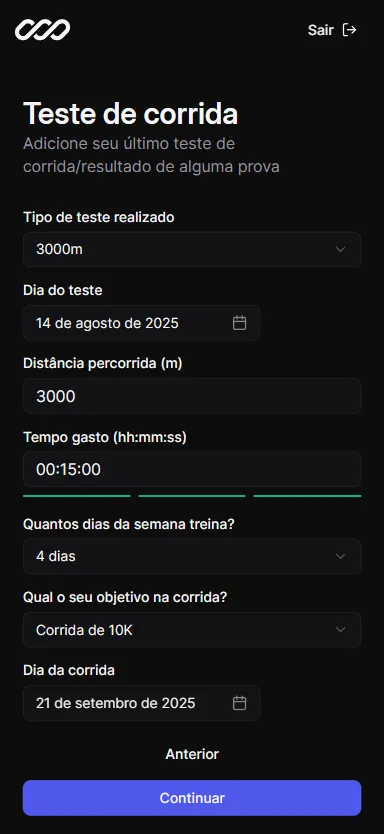
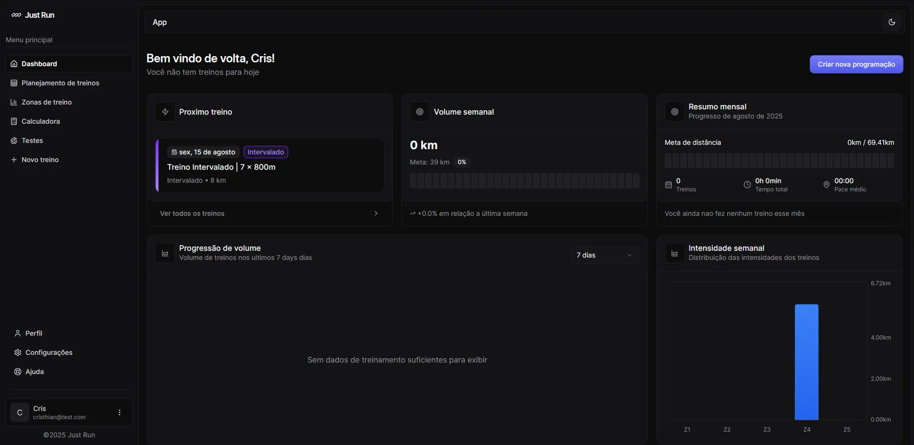
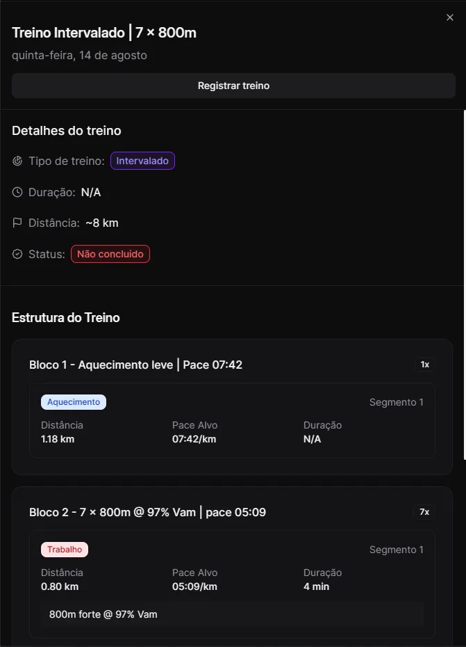
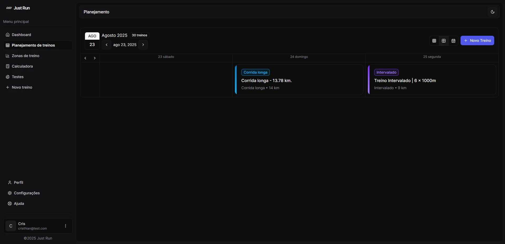
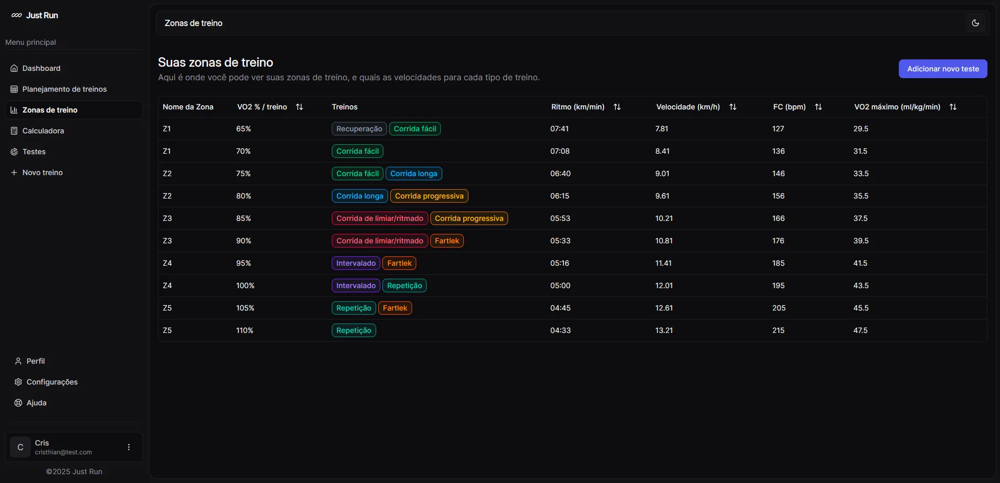
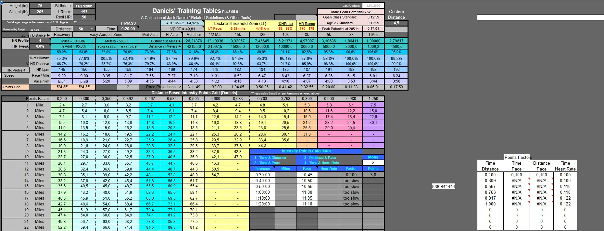
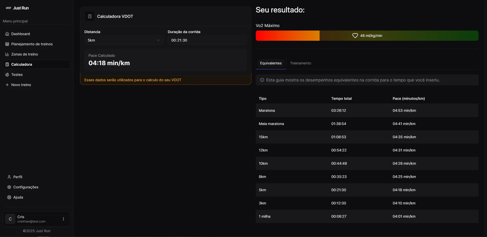

import Callout from "@/components/Callout.astro"

# Devlog #1 — Contexto e progresso atual

## 📌 Por que estou começando este registro agora
Já construí boa parte do aplicativo antes de decidir escrever um registro de desenvolvimento.  
Para evitar começar no meio da história, usarei esta primeira entrada para dar algum contexto, compartilhar meu progresso atual e delinear meus próximos passos.

---

## 🎯 Visão geral do projeto
O **JustRun** é uma plataforma online para corredores que desejam melhorar seus resultados de treinamento.  
Os usuários podem inserir seus dados pessoais (idade, sexo, peso, altura) e os resultados de um teste de corrida.  
O aplicativo calcula automaticamente as estatísticas de desempenho e gera uma periodização de treinamento totalmente personalizada.

---

## ⚙️ Progresso atual

### Integração
O fluxo de integração consiste em várias etapas nas quais o usuário atualiza informações pessoais, como peso, altura e idade.  
Esses dados serão usados nos cálculos de treinamento.

<div class="grid grid-cols-1 sm:grid-cols-2 md:grid-cols-3 gap-4">
  <div class="">
    
  </div>
  <div class="">
    
  </div>
  <div class="">
    
  </div>
</div>

---

### Página inicial
A página inicial exibe as principais métricas de treinamento:
- Próximo treino programado  
- Volume semanal de corrida  
- Resumo mensal  
- Progressão do volume ao longo do tempo  
- Distribuição semanal da intensidade



Clicar em um cartão de treino abre a `<WorkoutSheet />`, mostrando:
- Estrutura completa do treinamento
- Distância e tempo estimados
- Ritmos alvo e notas

<div class="flex justify-center">
  <div class="max-w-xs">
    
  </div>
</div>

### Exemplo da API

Aqui está um exemplo de um treino retornado pela API:
```js title="/api/workouts/:id response" collapse={6-61}
{
  "runType": "INTERVAL",
  "scheduledStart": "2025-07-12T00:57:41.506Z",
  "title": "Treino Intervalado | 19 x 300m",
  "blocks": [
    {
      "blockKind": "WARMUP",
      "repeatCount": 1,
      "orderIndex": 1,
      "description": "Aquecimento leve | Pace 05:23",
      "segments": [
        {
          "plannedDistanceM": 1182,
          "orderInBlock": 1,
          "segmentKind": "WARMUP",
          "targetPaceSPerKm": 323
        }
      ]
    },
    {
      "blockKind": "WORK",
      "repeatCount": 19,
      "orderIndex": 2,
      "description": "19 x 300m @ 102% Vam | pace 03:24",
      "segments": [
        {
          "plannedDistanceM": 300,
          "orderInBlock": 1,
          "segmentKind": "WORK",
          "targetPaceSPerKm": 204,
          "plannedDurationS": 63,
          "notes": [
            "300m forte @ 102% Vam"
          ]
        },
        {
          "plannedDistanceM": 300,
          "orderInBlock": 2,
          "segmentKind": "FLOAT",
          "targetPaceSPerKm": 350,
          "plannedDurationS": 75,
          "notes": [
            "Descanso trotando"
          ]
        }
      ]
    },
    {
      "blockKind": "COOLDOWN",
      "repeatCount": 1,
      "orderIndex": 3,
      "description": "Desaquecimento leve | Pace 05:23",
      "segments": [
        {
          "plannedDistanceM": 788,
          "orderInBlock": 1,
          "segmentKind": "COOLDOWN",
          "targetPaceSPerKm": 323
        }
      ]
    }
  ],
  "plannedDistanceM": 7880,
  "notes": "Intervalo de 7.88km com ~9.75km de intensidade. VAM 17.14km/h. Nível intermediate."
},
```

---

### Página de planejamento de treinos

A página de planejamento de treinos mostra toda a periodização atual do usuário de três maneiras diferentes:
- Dias
- Mês  
- Semana (essa é uma visualização personalizada que eu gostei de desenvolver)



Para criar este calendário, usei a biblioteca [Reat big calendar](https://www.npmjs.com/package/react-big-calendar), que é bastante fácil de configurar, bastando alguns passos para que ela faça a mágica, e, claro, precisei de alguns minutos para criar todo o css personalizado necessário.
Como o `react-big-calendar` não tem os tipos, tive que instalá-lo separadamente e procurar os tipos corretos para criar a visualização personalizada na pasta `node_modules`. Mas valeu a pena (talvez só eu ache isso -_-).

```tsx title="custom-view.tsx"
// CUSTOM WEEK
function MyWeek({
	date,
	localizer,
	max = localizer.endOf(new Date(), "day"),
	min = localizer.startOf(new Date(), "day"),
	scrollToTime = localizer.startOf(new Date(), "day"),
	...props
}: {
	date: Date;
	localizer: DateLocalizer;
	max: Date;
	min: Date;
	scrollToTime: Date;
}) {
	const currRange = useMemo(
		() => MyWeek.range(date, { localizer }),
		[date, localizer],
	);

	return (
		<TimeGrid
			date={date}
			eventOffset={15}
			localizer={localizer}
			max={max}
			min={min}
			range={currRange}
			scrollToTime={scrollToTime}
			{...props}
		/>
	);
}

MyWeek.range = (date: Date, { localizer }: { localizer: DateLocalizer }) => {
	const start = date;
	const end = dates.add(start, 2, "day");

	let current = start;
	const range = [];

	while (localizer.lte(current, end, "day")) {
		range.push(current);
		current = localizer.add(current, 1, "day");
	}

	return range;
};

MyWeek.navigate = (
	date: Date,
	action: NavigateAction,
	{ localizer }: { localizer: DateLocalizer },
) => {
	switch (action) {
		case Navigate.PREVIOUS:
			return localizer.add(date, -3, "day");

		case Navigate.NEXT:
			return localizer.add(date, 3, "day");

		default:
			return date;
	}
};

MyWeek.title = (date: Date) => {
	return `Semana de treinamento: ${date.toLocaleDateString()}`;
};
```

---

### Zonas de treinamento

Não quero me alongar muito aqui, basicamente esta tela mostra as zonas de treinamento do usuário para cada zona, que vão de Z1 a Z5, representando a porcentagem de vo2 usada em cada zona e os tipos de exercícios que são feitos nessas zonas de treinamento.



---

### Página de cálculo

Esta foi uma página desafiadora de desenvolver, especialmente porque eu precisava saber exatamente como os valores deveriam ser calculados. Então, enquanto procurava pela fórmula DVOT de Jack Daniels, usada na [Calculadora VDOT](https://vdoto2.com/calculator/), encontrei esta planilha do Excel:



Então, eu preciso entender exatamente como cada cálculo se relaciona com o outro para me dar os resultados corretos, então cheguei a esta conclusão:

#### VDOT

Para calcular a porcentagem de VDOT e o VDOT, respectivamente, esta foi a fórmula:

$$
0.8 + 0.1894393\, e^{-0.012778\, G_6 \cdot 1440} + 0.2989558\, e^{-0.1932605\, G_6 \cdot 1440}
$$

$$
\frac{-4.6 + 0.182258 \cdot \frac{\frac{F_8}{G_6}}{1440} + 0.000104 \cdot \frac{\frac{F_8}{G_6}}{1440}^2}{D_9}
$$

Se você não entendeu nada, eu também não, mas vou tentar explicar:

- `$E$6` é a distância, deve ser maior que 0
- `$G$6` é o tempo em dias (sim, o Excel trabalha em dias)
- `F8` é apenas uma função de mapeamento para obter a distância em metros com base no E6
- `D9` é a porcentagem VDOT (deve ser um valor máximo)

Convertendo isso para typescript, obtivemos duas funções diferentes:

1. A primeira calcula a porcentagem VDOT:

```ts
export function calculateVDOTPercentage({
	timeInSeconds,
}: {
	timeInSeconds: number;
}): number {
	const timeInDays = timeInSeconds / 86400;

	const percentageVDOT =
		0.8 +
		0.1894393 * Math.exp(-0.012778 * timeInDays * 1440) +
		0.2989558 * Math.exp(-0.1932605 * timeInDays * 1440);
	return percentageVDOT;
}
```

2. A segunda calcula o VDOT:

```ts
export function calculateVDOT({
	distanceM,
	durationS,
	VDOTPercentage,
}: {
	distanceM: number;
	durationS: number;
	VDOTPercentage: number;
}): number {
	// Convert the time value from seconds to days
	// as the original Excel spreadsheet performs calculations based on time in days.
	const timeInDays = durationS / 86400;
	const velocityKmPerDay = distanceM / timeInDays / 1440; // km/day

	const VO2Numerator =
		-4.6 + 0.182258 * velocityKmPerDay + 0.000104 * velocityKmPerDay ** 2;

	const VDOT = VO2Numerator / VDOTPercentage;

	return parseFloat(VDOT.toFixed(2));
}
```

Eu poderia passar um bom tempo escrevendo todos os cálculos que tive que fazer para converter uma pequena parte desta planilha em meu código Typescript, mas sou muito preguiçoso para isso. Prefiro apenas mostrar o resultado final.



---

## 📚 O desafio à frente

Recentemente, encontrei o livro [Daniel’s Running Formula](https://www.google.com/search?q=daniels+running+formula&sourceid=chrome&ie=UTF-8) de Jack Daniels — indiscutivelmente o treinador de corrida mais renomado que existe. Seus métodos de treinamento são cientificamente comprovados e altamente eficazes.

Meu plano é integrar a metodologia de Daniels ao gerador de treinos do aplicativo para obter resultados ainda mais precisos e personalizados.

O desafio? O livro tem mais de 400 páginas de conteúdo técnico, então levará tempo para compreendê-lo e implementá-lo totalmente. Mas estou convencido de que os resultados valerão a pena.

## 🔜 Próximos passos

- Estudar e resumir a fórmula de Jack Daniels
- Projetar um modelo de dados que apoie seus princípios de treinamento
- Atualizar a lógica do gerador de treinos
- Testar com corredores reais e coletar feedback
- Melhorar a navegação móvel do aplicativo