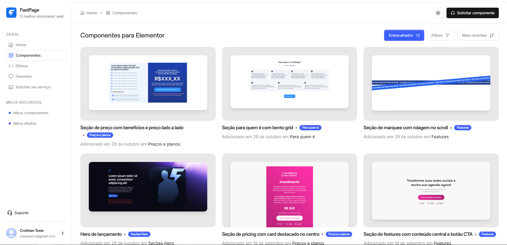

## Overview

[**FastPage**](https://app.figri.co) is a centralized hub offering ready-to-use CSS effects and JavaScript snippets tailored specifically for Elementor — the popular WordPress page builder.
The platform allows designers and developers to instantly copy high-quality, pre-tested code into their Elementor projects, significantly reducing development time and ensuring design consistency.

---

## Problem Statement

Designers working with WordPress and Elementor often face:
- Repeatedly writing the same CSS and JS code for common effects.
- Struggling with compatibility issues between custom code and Elementor's rendering.
- Losing valuable time searching for reliable snippets online.
- Inconsistent design results due to code variations from multiple sources.

---

## Key Features

- **Component Library**: Ready-to-use Elementor-compatible CSS effects and UI components.

- **Pre-Tested Snippets**: All code is tested for smooth integration with Elementor.
- **Copy-and-Paste Simplicity**: Zero configuration needed for most effects.
- **Search and Filter Tools**: Quickly find exactly what you need.
- **Responsive Design Ready**: Components and effects optimized for all devices.

---

## Technology Stack

- **Frontend**: React, React Router, Tailwind CSS, shadcn/ui
- **Backend & Hosting**: Firebase
- **Deployment**: Optimized for fast, scalable delivery

---

## How It Works

1. **Browse** through the categorized library of effects and components.
2. **Preview** live demos to see the effect in action.
3. **Copy** the code snippet directly.
4. **Paste** into Elementor’s page with the "Paste from another site" feature.
5. **Publish** your page with the enhanced design instantly.

---

## Benefits

- **Speed**: Reduce coding time by up to 70%.
- **Consistency**: Maintain a unified look across all projects.
- **Reliability**: All snippets are verified for Elementor compatibility.
- **Creativity Boost**: Focus more on design vision, less on technical hurdles.

---

## Conclusion

FastPage is more than a code library — it’s a productivity accelerator for WordPress and Elementor professionals.  
By offering a curated, reliable, and beautifully organized set of CSS and JS effects, FastPage empowers web designers to deliver high-quality projects faster and with greater creative freedom.