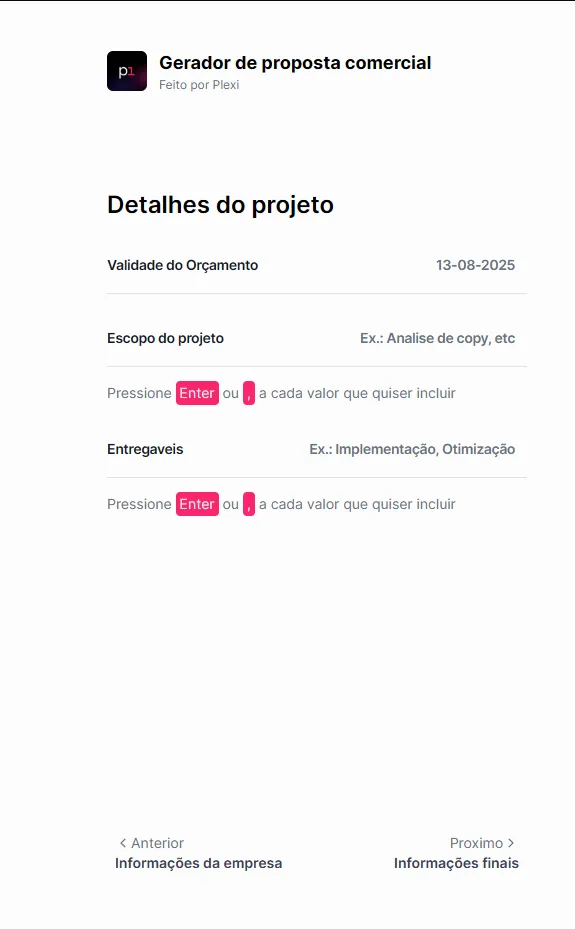
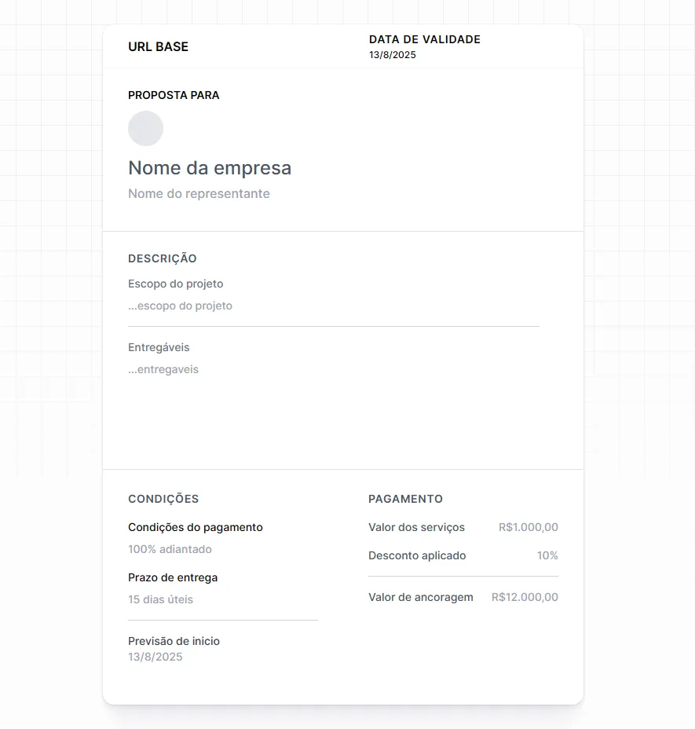

# Overview

[**PlexiForm**](https://plexi-form.netlify.app) is a lightweight and efficient form solution that dynamically generates URLs containing parameters, which are then used to populate an Elementor-based proposal template.  
By combining simplicity with flexibility, PlexiForm streamlines the process of creating personalized commercial proposals in just a few clicks.

---

## Problem Statement

Sales teams and agencies often face:
- Time-consuming manual editing of Elementor templates for each proposal.
- Risk of errors when copying and pasting client data.
- Lack of a quick, repeatable process to generate consistent proposals.
- Inefficiency in scaling proposal creation for multiple clients.

---

## Key Features

- **Dynamic URL Generation**: Automatically builds a link with all required parameters.
- **Elementor Integration**: Seamlessly works with predefined templates.
- **Instant Proposal Creation**: One click takes you to a ready-to-customize proposal.
- **No Backend Required**: Runs entirely on the client side.
- **Responsive and Lightweight**: Built with modern, performance-focused design.

  

    
  

  

    
  

---

## Technology Stack

- **Frontend**: HTML, Tailwind CSS
- **Logic Layer**: JavaScript Modules
- **Deployment**: Static hosting on netlify

---

## How It Works

1. **Fill out** the form with the necessary proposal details (e.g., client name, project scope, price).
2. **Live-preview**: the values that user are filling out are being shown on the right of the screen.
2. **Generate** a unique URL containing encoded parameters.
3. **Open** the Elementor template using that URL.
4. **View** the pre-filled proposal ready for final adjustments.
5. **Send** the polished proposal to the client instantly.

---

## Benefits

- **Speed**: Create a complete proposal link in seconds.
- **Accuracy**: Reduce errors through automated data insertion.
- **Consistency**: Maintain brand and style uniformity across proposals.
- **Scalability**: Handle multiple clients without additional complexity.

---

## Future Roadmap

- **Multi-Language Support**: Generate proposals in different languages.
- **Parameter Encryption**: Protect sensitive client information in URLs.
- **Template Selector**: Choose from multiple Elementor templates directly from the form.
- **Integration API**: Connect with CRM tools for automatic proposal generation.

---

## Conclusion

PlexiForm transforms how commercial proposals are created by merging a simple form interface with the power of Elementor templates.  
Its lightweight, no-backend approach makes it perfect for freelancers, agencies, and sales teams seeking speed, accuracy, and professionalism in their proposal workflows.

