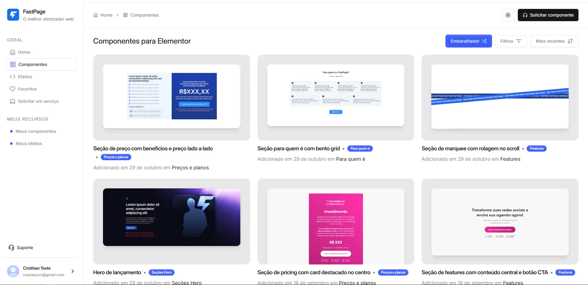

## Visão geral

[**FastPage**](https://app.figri.co) é um hub centralizado que oferece efeitos CSS prontos para uso e trechos de JavaScript personalizados especificamente para o Elementor — o popular construtor de páginas do WordPress.
A plataforma permite que designers e desenvolvedores copiem instantaneamente códigos de alta qualidade e pré-testados para seus projetos Elementor, reduzindo significativamente o tempo de desenvolvimento e garantindo a consistência do design.

---

## Descrição do problema

Designers que trabalham com WordPress e Elementor frequentemente enfrentam:
- Escrever repetidamente o mesmo código CSS e JS para efeitos comuns.
- Problemas de compatibilidade entre o código personalizado e a renderização do Elementor.
- Perda de tempo valioso procurando trechos confiáveis online.
- Resultados de design inconsistentes devido a variações de código de várias fontes.

---

## Principais recursos

- **Biblioteca de componentes**: efeitos CSS e componentes de interface do usuário prontos para uso e compatíveis com o Elementor.

- **Snippets pré-testados**: todo o código é testado para integração perfeita com o Elementor.
- **Simplicidade de copiar e colar**: nenhuma configuração necessária para a maioria dos efeitos.
- **Ferramentas de pesquisa e filtro**: encontre rapidamente exatamente o que você precisa.
- **Pronto para design responsivo**: componentes e efeitos otimizados para todos os dispositivos.

---

## Pilha de tecnologia

- **Frontend**: React, React Router, Tailwind CSS, shadcn/ui
- **Backend e hospedagem**: Firebase
- **Implantação**: otimizada para entrega rápida e escalável

---

## Como funciona

1. **Navegue** pela biblioteca categorizada de efeitos e componentes.
2. **Visualize** demonstrações ao vivo para ver o efeito em ação.
3. **Copie** o trecho de código diretamente.
4. **Cole** na página do Elementor com o recurso “Colar de outro site”.
5. **Publique** sua página com o design aprimorado instantaneamente.

---

## Benefícios

- **Velocidade**: reduza o tempo de codificação em até 70%.
- **Consistência**: mantenha uma aparência unificada em todos os projetos.
- **Confiabilidade**: todos os trechos são verificados quanto à compatibilidade com o Elementor.
- **Aumento da criatividade**: concentre-se mais na visão do design e menos nos obstáculos técnicos.

---

## Conclusão

O FastPage é mais do que uma biblioteca de códigos — é um acelerador de produtividade para profissionais do WordPress e do Elementor.
Ao oferecer um conjunto selecionado, confiável e bem organizado de efeitos CSS e JS, o FastPage permite que os web designers entreguem projetos de alta qualidade com mais rapidez e maior liberdade criativa.