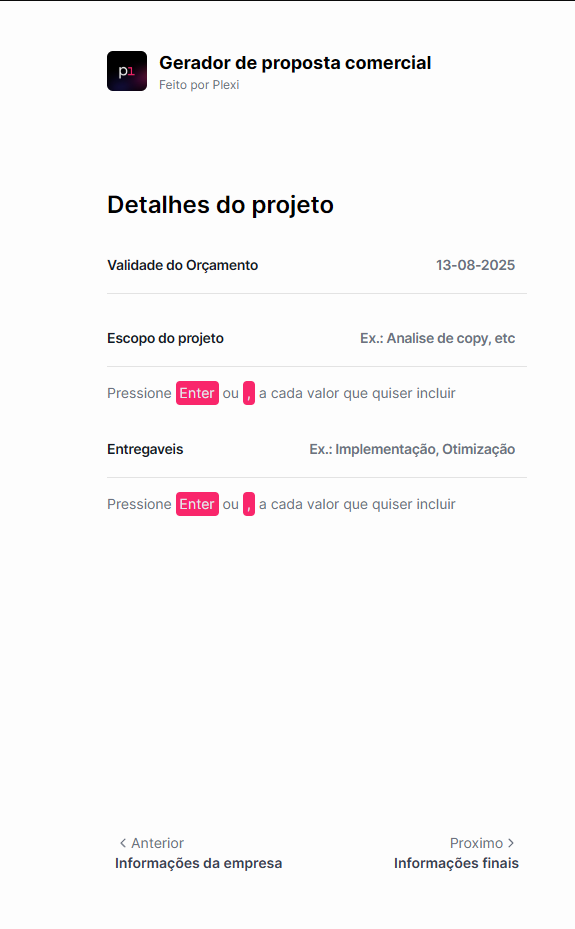
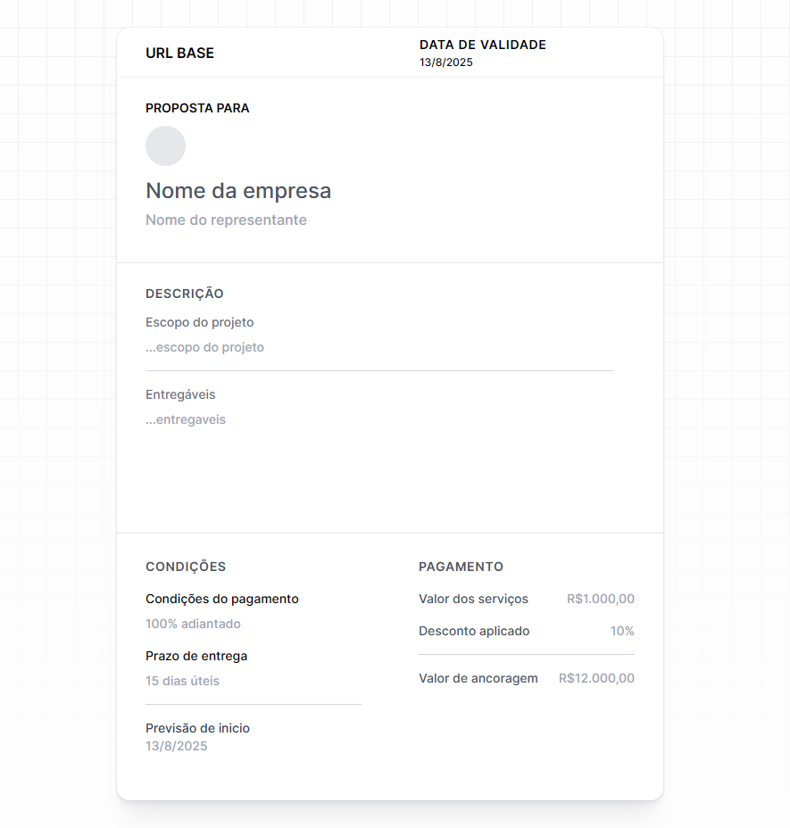

# Visão geral

[**PlexiForm**](https://plexi-form.netlify.app) é uma solução leve e eficiente para formulários que gera dinamicamente URLs contendo parâmetros, que são então usados para preencher um modelo de proposta baseado no Elementor.  
Combinando simplicidade com flexibilidade, o PlexiForm agiliza o processo de criação de propostas comerciais personalizadas com apenas alguns cliques.

---

## Descrição do problema

As equipes de vendas e agências frequentemente enfrentam:
- Edição manual demorada de modelos Elementor para cada proposta.
- Risco de erros ao copiar e colar dados do cliente.
- Falta de um processo rápido e repetível para gerar propostas consistentes.
- Ineficiência na criação de propostas para vários clientes.

---

## Principais recursos

- **Geração dinâmica de URL**: cria automaticamente um link com todos os parâmetros necessários.
- **Integração com o Elementor**: funciona perfeitamente com modelos predefinidos.
- **Criação instantânea de propostas**: com um clique, você acessa uma proposta pronta para personalizar.
- **Não requer back-end**: funciona inteiramente no lado do cliente.
- **Responsivo e leve**: construído com um design moderno e focado no desempenho.

  

    
  

  

    
  

---

## Pilha de tecnologia

- **Frontend**: HTML, Tailwind CSS
- **Camada lógica**: Módulos JavaScript
- **Implantação**: Hospedagem estática no netlify

---

## Como funciona

1. **Preencha** o formulário com os detalhes necessários da proposta (por exemplo, nome do cliente, escopo do projeto, preço).
2. **Visualização ao vivo**: os valores que o usuário está preenchendo são exibidos no lado direito da tela.
2. **Gere** uma URL exclusiva contendo parâmetros codificados.
3. **Abra** o modelo Elementor usando essa URL.
4. **Visualize** a proposta pré-preenchida pronta para ajustes finais.
5. **Envie** a proposta finalizada ao cliente instantaneamente.

---

## Benefícios

- **Velocidade**: crie um link de proposta completo em segundos.
- **Precisão**: reduza erros por meio da inserção automatizada de dados.
- **Consistência**: mantenha a uniformidade da marca e do estilo em todas as propostas.
- **Escalabilidade**: lide com vários clientes sem complexidade adicional.

---

## Roteiro futuro

- **Suporte multilíngue**: gere propostas em diferentes idiomas.
- **Criptografia de parâmetros**: proteja informações confidenciais do cliente em URLs.
- **Seletor de modelos**: escolha entre vários modelos Elementor diretamente do formulário.
- **API de integração**: conecte-se a ferramentas de CRM para geração automática de propostas.

---

## Conclusão

O PlexiForm transforma a forma como as propostas comerciais são criadas, combinando uma interface de formulário simples com o poder dos modelos Elementor.  
Sua abordagem leve e sem back-end o torna perfeito para freelancers, agências e equipes de vendas que buscam rapidez, precisão e profissionalismo em seus fluxos de trabalho de propostas.
